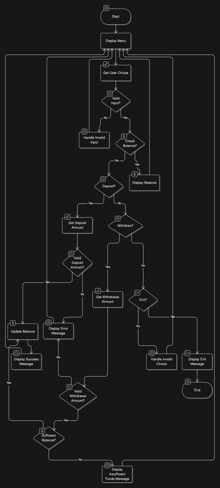

# Simple-Bank-Management-System

## 1. Overview

This is a simple C-based banking system that allows users to perform basic banking operations such as checking their balance, depositing funds, and withdrawing money. The system is designed for console-based interaction and ensures proper handling of user inputs.

### 1.1 Learning Outcomes

I created this project for educational purposes. By working through this implementation, you will gain knowledge in the following fundamental C programming concepts:

- **Variables & Data Types** – Understanding how to store and manage different data types.
- **Formatted Output (printf)** – Displaying information in a structured and user-friendly format.
- **User Input Handling (scanf)** – Receiving user input and safely processing it.
- **Looping (while loop)** – Implementing continuous user interactions.
- **Buffer Clearing (while and getchar)** – Preventing unwanted input buffering issues.
- **Conditional Statements (if, if-else)** – Making decisions based on user choices.
- **Basic Arithmetic Operations** – Performing calculations for deposits and withdrawals.
- **Program Logic Design** – Structuring a functional and interactive program.

### 1.2 Challenge Level

This project is **beginner-friendly** and serves as an excellent starting point for those looking to enhance their understanding of **C programming fundamentals and logical problem-solving**. It introduces key programming concepts in a **structured and practical manner**, making it ideal for learners with **basic C knowledge**.

### 1.3 Learning Duration

The project is designed to be **completed within 6-8 hours**, depending on the learner’s familiarity with C programming. This estimation includes **coding, debugging, and testing** but **does not include** additional time for **presentation or documentation**.

## 2. Features

- Initial balance starts at $1000.00.
- User-friendly menu with four operations:
    1. Check Balance
    2. Deposit Money
    3. Withdraw Money
    4. Exit the System
- Error handling for invalid inputs.
- Ensures valid deposit and withdrawal amounts to prevent incorrect transactions.
- Lightweight and efficient C implementation.

## 3. Installation & Compilation

### 3.1 Prerequisites

Ensure you have a C compiler installed.

### 3.2 Compile the program

```c
gcc main.c -o simple_bank
```

### 3.3 Run the program

```c
./simple_bank
```

## 4. Usage

### 4.1 Banking Operations

Once you run the program, you will see a menu like this:

```c
====================================
      Welcome to the Simple Bank      
====================================
Your initial balance is: 1000.00 USD

Please select an operation:
1. Check Balance
2. Deposit
3. Withdraw
4. Exit
Enter your choice (1-4): 
```

Users can enter a number (1-4) to perform the corresponding banking operation.

### 4.2 Deposit the Valid Amount

If the user selects Option 2 (Deposit) and enters a valid amount, the deposit will be processed successfully.

```c
====================================
      Welcome to the Simple Bank      
====================================
Your initial balance is: 1000.00 USD

Please select an operation:
1. Check Balance
2. Deposit
3. Withdraw
4. Exit
Enter your choice (1-4): 2

Enter deposit amount: 50
Deposit successful!
Your new balance is: 1050.00 USD
```

### 4.3 Deposit the Invalid Amount

If the user tries to deposit a negative amount or zero, an error message is displayed.

```c
====================================
      Welcome to the Simple Bank      
====================================
Your initial balance is: 1000.00 USD

Please select an operation:
1. Check Balance
2. Deposit
3. Withdraw
4. Exit
Enter your choice (1-4): 2

Enter deposit amount: -100
Deposit amount must be greater than 0!
```

### 4.4 Withdraw the Valid Amount

If the user selects Option 3 (Withdraw) and enters a valid amount that does not exceed the balance, the withdrawal will be processed.

```c
====================================
      Welcome to the Simple Bank      
====================================
Your initial balance is: 1000.00 USD

Please select an operation:
1. Check Balance
2. Deposit
3. Withdraw
4. Exit
Enter your choice (1-4): 3

Enter withdrawal amount: 100
Withdrawal successful!
Your new balance is: 900.00 USD
```

### 4.5 Attempting to Withdraw More Than the Available Balance

- If the user tries to withdraw more than their balance, the system will reject the transaction.
- After the failed withdrawal, the user can check their balance:

```c
====================================
      Welcome to the Simple Bank      
====================================
Your initial balance is: 1000.00 USD

Please select an operation:
1. Check Balance
2. Deposit
3. Withdraw
4. Exit
Enter your choice (1-4): 3

Enter withdrawal amount: 2000
Insufficient balance. Withdrawal failed.

Please select an operation:
1. Check Balance
2. Deposit
3. Withdraw
4. Exit
Enter your choice (1-4): 1

Your current balance is: 1000.00 USD
```

### 4.6 Handling Invalid Banking Options

- If the user enters a number outside the range of (1-4), they will receive an error message.
- If the user enters a non-numeric value, such as a letter, the system will also reject it.
- The program will then re-prompt the user to enter a valid option.

```c
====================================
      Welcome to the Simple Bank      
====================================
Your initial balance is: 1000.00 USD

Please select an operation:
1. Check Balance
2. Deposit
3. Withdraw
4. Exit
Enter your choice (1-4): 6

Invalid choice. Please enter a number between 1 and 4.

Please select an operation:
1. Check Balance
2. Deposit
3. Withdraw
4. Exit
Enter your choice (1-4): a

Invalid input. Please enter a number between 1 and 4.

Please select an operation:
1. Check Balance
2. Deposit
3. Withdraw
4. Exit
Enter your choice (1-4): 
```

## 5. Implementation

This section provides an overview of the implementation details and the logical structure of the banking system.

### 5.1 Flowchart



### 5.2 Key Implementation Details

- Looping Mechanism: A while loop ensures the program runs continuously until the user chooses to exit.
- User Input Handling: Uses scanf for input collection, with additional handling to clear the buffer (getchar() to prevent input errors).
- Error Handling: Ensures inputs are within the valid range, prevents negative deposits, and checks for sufficient funds before allowing withdrawals.
- Exit Mechanism: The program terminates when the user selects option 4, displaying a farewell message.

## 6. License

This project is licensed under the **MIT License** – feel free to use, modify, and distribute it.

## 7. Contact

If you have any questions, suggestions, or would like to discuss improvements to this project, feel free to reach out:

🌐 Website: [Alex Tian](https://alextianyf.github.io/CV/)

I appreciate your feedback and contributions! 🚀
